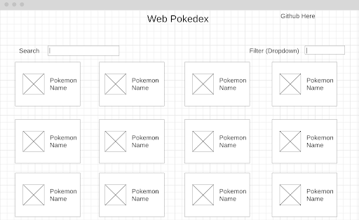

# **Web Pokedex Project Proposal**

Joshua Zhao

## Background

Pokemon is a popular game franchise around the world where players could collect and train their own parties of Pokemon in an adventure to become the best there ever was. The purpose of this project is to create a functional web Pokedex as a guide to help users find useful information about their favorite Pokemon. Features of the Web Pokedex are listed below.

## Functionality & MVPs

In the Web Pokedex, users will be able to:

* Scroll through a comprehensive list of Pokemon with simple descriptions and images.
* Filter the list of Pokemon on the page given a parameter.
* Search for a specific pokemon.
* View detailed information about specific Pokemon.

In addition, this project will include:

* This README file to explain the purpose and usage of this application.
* Stylish animations when transitioning pages.

## Wireframes

  (<a href="#">Back to top</a>)(<a href="#gdcalert2">Next alert</a>) >>>>> 

  (<a href="#">Back to top</a>)(<a href="#gdcalert3">Next alert</a>) >>>>> 

## Technologies, Libraries, APIs

* HTML
* CSS
* JavaScript (just using vanilla DOM)
* PokeAPI

## Implementation Timeline

* Friday Afternoon & Weekend
    * Create and style basic HTML structure of project
    * Research PokeAPI
* Monday
    * Research the PokeAPI
    * Figure out how to make all the PokeAPI requests
* Tuesday
    * Manipulate the DOM after making API requests
* Wednesday
    * Style the project to make it look cool
* Thursday Morning
    * Final touches